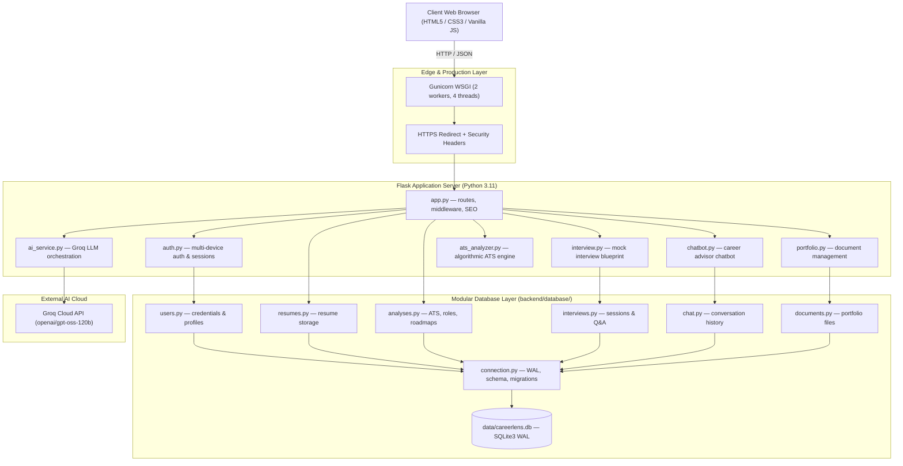

# 📄 CareerLens — Comprehensive Technical & Functional Report

> **Version**: 2.0 (Production)  
> **Last Updated**: October 2026  
> **Stack**: Python 3.11 · Flask 3.x · SQLite 3 WAL · Groq LLM · Gunicorn · Docker  
> **Deployment Target**: Render.com (free tier) · Custom domain `careerlens.in`

---

## 1. Executive Summary

**CareerLens** is an intelligent, full-stack Career Intelligence and Mock Interview Platform engineered to bridge the gap between job seekers and competitive industry hiring bars. It uses Large Language Models (LLMs) via the **Groq API** combined with deterministic heuristics to provide:

1. **Universal Multi-Device Authentication** — Centralized SQLite DB authentication; same credentials work on any device/browser
2. **Target Role Alignment** — LLM-backed job matching with evidence-based rationales
3. **Actionable Learning Roadmap** — Prioritized skill-gap roadmaps with portfolio milestones
4. **Company-Based Mock Interview Loop** — PYQ-labeled + AI-generated questions with real-time critique
5. **Algorithmic ATS Compatibility Engine** — Deterministic scoring of resume structure and keywords
6. **AI Career Strategist Chatbot** — Groq-backed conversational career advisor
7. **Production-Ready Architecture** — Docker, Gunicorn, SQLite WAL, SEO/PWA, Render.com deployment

---

## 2. High-Level System Architecture



---

## 3. Project File Structure

```
career_lens_website/
├── app.py                      # Main Flask app: routes, middleware, SEO, Gunicorn entry
├── auth.py                     # Auth Blueprint: register, login, logout, profile, password
├── ats_analyzer.py             # Deterministic ATS scoring engine (no LLM dependency)
├── ai_service.py               # Groq LLM: roles, skills, roadmap, chatbot orchestration
├── interview.py                # Mock Interview Blueprint: sessions, Q&A, debrief
├── chatbot.py                  # Chatbot Blueprint: Groq-backed career advisor
├── portfolio.py                # Portfolio Blueprint: document upload & management
├── database.py                 # Compatibility shim re-exporting backend.database
│
├── backend/
│   └── database/
│       ├── __init__.py         # Public API surface for all DB functions
│       ├── connection.py       # Connection, schema init, safe migrations, legacy migration
│       ├── users.py            # User CRUD, hashing, get_user_by_identifier
│       ├── resumes.py          # Resume save/retrieve/activate
│       ├── analyses.py         # ATS, role, roadmap persistence
│       ├── interviews.py       # Mock interview sessions & questions
│       ├── chat.py             # Chatbot conversation history
│       ├── documents.py        # Portfolio document management
│       └── db_viewer.py        # CLI inspection tool (--stats, --table, --export)
│
├── templates/
│   ├── index.html              # SPA landing page with full auth, upload, analysis UI
│   ├── 404.html                # Branded 404 error page
│   └── 500.html                # Branded 500 error page
│
├── static/
│   ├── css/style.css           # Modern dark-mode UI, glassmorphism, animations
│   ├── js/main.js              # Frontend logic: auth state, API calls, UI rendering
│   └── favicon.png             # Site favicon
│
├── data/careerlens.db          # Primary SQLite database (9 tables, WAL mode)
├── Dockerfile                  # Production container image
├── docker-compose.yml          # Local dev compose with data/ volume
├── render.yaml                 # Render.com auto-deploy blueprint
├── gunicorn.conf.py            # Gunicorn: 2 workers, 4 threads, on_starting hook
├── requirements.txt            # Python dependencies
├── .env / .env.example         # Local env vars (git-ignored)
├── .gitignore                  # Excludes .env, .db, .venv, uploads/
└── CNAME                       # careerlens.in (GitHub Pages)
```

---

## 4. Authentication System — Multi-Device Architecture

### 4.1 Problem Solved
The original system stored user data in browser `localStorage`, making credentials device-specific. Users registering on one laptop could not log in on another device. This has been fully resolved.

### 4.2 Solution

| Layer | Implementation |
|---|---|
| **Storage** | `data/careerlens.db` — single central source of truth |
| **Password Hashing** | `salt:sha256(salt + password)` with bcrypt-compatible fallback |
| **Login Identifier** | Email **or** username (case-insensitive via `LOWER()` index) |
| **Session** | Flask server-side signed cookies (30-day lifetime) |
| **Device Binding** | None — purely credential-based |
| **Legacy Migration** | Auto-imports accounts from old root `careerlens.db` |
| **Email Validation** | Standard RFC-5321 regex (any valid email, not just Gmail) |

### 4.3 Auth API Endpoints

| Method | Endpoint | Description |
|---|---|---|
| `POST` | `/auth/register` | Create account; auto-login on success |
| `POST` | `/auth/login` | Verify email/username + password |
| `POST` | `/auth/logout` | Clear session |
| `GET` | `/auth/me` | Return current user (or `{authenticated: false}`) |
| `PUT` | `/auth/profile` | Update name, bio, location, GitHub, LinkedIn, etc. |
| `PUT` | `/auth/password` | Change password (requires current password) |

### 4.4 Registration & Login Flow

```
REGISTRATION:
  POST /auth/register {name, email, password, username?}
  → Validate → Hash password → INSERT users
  → Set signed session cookie → Return user object

LOGIN (any device):
  POST /auth/login {email OR username, password}
  → get_user_by_identifier(identifier)  [LOWER(email) OR LOWER(username)]
  → verify_password(stored_hash, input)
  → Set signed session cookie → Return user object
```

### 4.5 Current Database State

| Table | Rows |
|---|---|
| users | 9 |
| resumes | 0 |
| ats_analyses | 0 |
| role_analyses | 0 |
| learning_roadmaps | 0 |
| mock_interviews | 6 |
| interview_questions | 50 |
| chat_history | 16 |
| documents | 3 |

---

## 5. Core Feature Modules

### 5.1 Resume Upload & Processing (`POST /upload`)
- Accepts PDF up to 16 MB
- Text extraction via **PyMuPDF** (handles multi-column PDFs)
- Stored in in-memory `resume_cache` (keyed by session UUID)
- Auto-persisted to `resumes` table when logged in
- Auto-restored from DB on next login

### 5.2 ATS Compatibility Analyzer (`POST /analyze/ats`)

| Dimension | Max Score |
|---|---|
| Contact Information | 15 |
| Education | 15 |
| Experience | 20 |
| Skills | 20 |
| Formatting | 15 |
| Keywords | 15 |

Returns: `score`, `rating`, `breakdown`, `found_sections`, `missing_sections`, `suggestions`  
Persisted to `ats_analyses` table when authenticated.

### 5.3 Target Role Recommendation (`POST /analyze/jobs`)
- **Primary**: Groq LLM analyzes resume → top 3–5 career roles with justifications, companies, match scores
- **Fallback**: Deterministic keyword-matching across 8 pre-defined `CAREER_ROLES`

### 5.4 Skill Gap Analyzer (`POST /analyze/skills`)
- LLM performs granular analysis: matched skills, missing skills, priority (High/Medium/Later)
- Persisted to `role_analyses` table

### 5.5 Learning Roadmap Generator (`POST /analyze/roadmap`)
- LLM generates 3–6 month structured roadmap: phases, weekly milestones, portfolio projects
- Persisted to `learning_roadmaps` table

### 5.6 Mock Interview Engine

**Session lifecycle:**
```
POST /interview/start      → Create session (company, role, JD optional)
GET  /interview/question   → Fetch next question (PYQ labeled vs AI-generated)
POST /interview/answer     → Submit answer → receive AI critique + score
POST /interview/complete   → Finalize → generate debrief report
GET  /interview/sessions   → List user's past sessions
GET  /interview/<id>       → Full session with questions & answers
```

**Academic integrity:** PYQs labeled `"Previous Year Question"`, AI questions labeled `"AI-Generated Practice Question"`.

### 5.7 AI Career Strategist Chatbot
- Persistent per-user conversation history in `chat_history` table
- Groq LLM with career-specialist system prompt
- Resume context auto-injected for personalized advice
- `DELETE /chatbot/history` to clear conversation

### 5.8 Portfolio Manager
```
POST   /portfolio/upload          → Upload document (PDF, DOC, DOCX, image)
GET    /portfolio/documents       → List user's documents
DELETE /portfolio/<id>            → Delete document
GET    /portfolio/download/<id>   → Download document
```

---

## 6. Database Schema (SQLite3 WAL)

```sql
users               (id, name, email, username, password_hash, phone, bio, location,
                     job_title, experience_years, github_url, linkedin_url, avatar_url,
                     created_at, updated_at)

resumes             (id, user_id→users, filename, original_name, file_size,
                     word_count, char_count, raw_text, is_active, uploaded_at)

documents           (id, user_id→users, name, category, filename, file_size,
                     file_type, description, uploaded_at)

ats_analyses        (id, user_id→users, resume_id→resumes, score, rating, word_count,
                     found_sections, missing_sections, matched_keywords,
                     missing_keywords, suggestions, breakdown_json, created_at)

role_analyses       (id, user_id→users, resume_id→resumes, role, match_score,
                     matched_skills, missing_skills, companies, recommendations,
                     result_json, created_at)

learning_roadmaps   (id, user_id→users, resume_id→resumes, target_role,
                     roadmap_json, created_at)

mock_interviews     (id, user_id→users, company, role, status, score, notes,
                     created_at, completed_at)

interview_questions (id, interview_id→mock_interviews, question, category, answer,
                     feedback, score, order_num, is_pyq, source_label,
                     source_note, answered_at)

chat_history        (id, user_id→users, role, content, created_at)
```

**DB features:** WAL mode · FK enforcement · case-insensitive unique index on email · safe `ALTER TABLE ADD COLUMN` migrations · auto legacy DB import

---

## 7. SEO & Production Configuration

### 7.1 SEO Implementation

| Element | Status |
|---|---|
| Title tag | ✅ `CareerLens — AI-Powered Career Intelligence Platform` |
| Meta description | ✅ Keyword-rich, under 160 chars |
| Canonical URL | ✅ `<link rel="canonical" href="https://careerlens.in/">` |
| Open Graph tags | ✅ og:title, og:description, og:image, og:url, og:type |
| Twitter Card | ✅ twitter:card, twitter:title, twitter:description |
| H1 structure | ✅ Single H1 per page |
| Semantic HTML | ✅ header, main, section, footer, nav |
| Mobile-friendly | ✅ Responsive CSS, meta viewport |
| robots.txt | ✅ Dynamic route `/robots.txt` |
| sitemap.xml | ✅ Dynamic route `/sitemap.xml` |
| favicon.ico | ✅ `/favicon.ico` → static/favicon.png |

### 7.2 Security Headers
```
X-Content-Type-Options: nosniff
X-Frame-Options: SAMEORIGIN
X-XSS-Protection: 1; mode=block
Referrer-Policy: strict-origin-when-cross-origin
Cache-Control: public, max-age=31536000 (static assets only)
```

### 7.3 HTTPS
- `before_request` hook detects `X-Forwarded-Proto: http` (Render load balancer) → 301 to HTTPS
- Session: `SESSION_COOKIE_HTTPONLY=True`, `SESSION_COOKIE_SAMESITE=Lax`

---

## 8. Deployment

### 8.1 Render.com (render.yaml)
```yaml
services:
  - type: web
    name: careerlens
    runtime: python
    region: singapore
    plan: free
    buildCommand: pip install -r requirements.txt
    startCommand: gunicorn -c gunicorn.conf.py app:app
    disk:
      mountPath: /app/data
      sizeGB: 1
    envVars:
      - FLASK_SECRET_KEY: <auto-generated>
      - GROQ_API_KEY: <set in dashboard>
      - DATABASE_PATH: /app/data/careerlens.db
      - SITE_URL: https://careerlens.in
      - PORT: 10000
```

> ⚠️ **Persistent disk requires Render Starter plan ($7/mo)**. On the free tier, SQLite resets on every deploy. For free persistent storage, migrate to Supabase PostgreSQL.

### 8.2 Environment Variables

| Variable | Required | Default |
|---|---|---|
| `FLASK_SECRET_KEY` | Yes | — |
| `GROQ_API_KEY` | Yes | — |
| `GROQ_MODEL` | No | `openai/gpt-oss-120b` |
| `DATABASE_PATH` | No | `data/careerlens.db` |
| `SITE_URL` | No | `https://careerlens.in` |
| `PORT` | No | `10000` |
| `FLASK_DEBUG` | No | `false` |

### 8.3 Gunicorn Config
```python
workers = 2            # 2x CPU+1 for I/O bound
threads = 4            # Groq API calls benefit from threading
worker_class = "gthread"
timeout = 120          # LLM calls can take 10–30s
bind = "0.0.0.0:10000"
```

### 8.4 Docker
```bash
docker compose up --build    # Local dev on port 5001
```

---

## 9. AI Service Architecture

### 9.1 Model Strategy

| Task | Model | Max Tokens |
|---|---|---|
| Role analysis | openai/gpt-oss-120b | 2000 |
| Skill gap | openai/gpt-oss-120b | 2000 |
| Learning roadmap | openai/gpt-oss-120b | 3000 |
| Interview questions | openai/gpt-oss-120b | 1500 |
| Answer evaluation | openai/gpt-oss-120b | 1000 |
| Chatbot | openai/gpt-oss-20b (fast) | 1000 |

### 9.2 Fallback Strategy
1. Primary model → retry with smaller model
2. LLM unavailable → deterministic keyword-matching fallback
3. JSON parse failure → structured error, never a 500 crash
4. Resume text truncated to 3,000 chars for prompt efficiency

---

## 10. Complete API Reference

| Method | Endpoint | Auth | Description |
|---|---|---|---|
| POST | `/auth/register` | No | Register new user |
| POST | `/auth/login` | No | Login (email or username) |
| POST | `/auth/logout` | Yes | Clear session |
| GET | `/auth/me` | No | Current user status |
| PUT | `/auth/profile` | Yes | Update profile |
| PUT | `/auth/password` | Yes | Change password |
| POST | `/upload` | No | Upload PDF resume |
| POST | `/analyze/ats` | No | ATS score |
| POST | `/analyze/jobs` | No | Role recommendations |
| POST | `/analyze/skills` | No | Skill gap analysis |
| POST | `/analyze/roadmap` | No | Learning roadmap |
| GET | `/dashboard/summary` | Yes | User stats overview |
| GET | `/dashboard/history` | Yes | Full analysis history |
| GET | `/dashboard/resume` | Yes | Active resume metadata |
| POST | `/interview/start` | Yes | Start interview session |
| GET | `/interview/question` | Yes | Next question |
| POST | `/interview/answer` | Yes | Submit answer + get feedback |
| POST | `/interview/complete` | Yes | Finalize + debrief |
| GET | `/interview/sessions` | Yes | Past sessions |
| GET | `/interview/<id>` | Yes | Session details |
| POST | `/chatbot/chat` | Yes | Send message |
| GET | `/chatbot/history` | Yes | Conversation history |
| DELETE | `/chatbot/history` | Yes | Clear history |
| POST | `/portfolio/upload` | Yes | Upload document |
| GET | `/portfolio/documents` | Yes | List documents |
| DELETE | `/portfolio/<id>` | Yes | Delete document |
| GET | `/portfolio/download/<id>` | Yes | Download document |
| GET | `/robots.txt` | No | Search engine rules |
| GET | `/sitemap.xml` | No | XML sitemap |
| GET | `/favicon.ico` | No | Site favicon |
| GET | `/` | No | Main SPA page |

---

## 11. Known Limitations & Roadmap

| Issue | Severity | Resolution Path |
|---|---|---|
| SQLite resets on free Render tier | High | Upgrade to Starter ($7/mo) or migrate to Supabase |
| No email verification | Medium | Add SendGrid/Resend OTP on registration |
| No rate limiting on auth endpoints | Medium | Add Flask-Limiter |
| In-memory resume cache lost on restart | Low | Mitigated by DB auto-restore on login |
| PYQ database limited | Low | Expand company/role coverage |

### Planned Enhancements
1. PostgreSQL via Supabase/Neon (free, persistent)
2. Google OAuth one-click login
3. Resume Builder with PDF export
4. Rate limiting with Flask-Limiter
5. Email OTP verification
6. PDF export of ATS report, roadmap, interview debrief
7. Admin usage dashboard

---

## 12. Development Quick Start

### Python (Local)
```bash
git clone https://github.com/bhupendrasinghh/Career_Lens.git
cd career_lens_website
python3 -m venv .venv && source .venv/bin/activate
pip install -r requirements.txt
cp .env.example .env   # Edit: add GROQ_API_KEY
python app.py           # http://localhost:5001
```

### Docker (Local)
```bash
docker compose up --build   # http://localhost:5001
```

### Deploy to Render
```bash
git push origin main   # Render auto-deploys via render.yaml
```

---

## 13. Testing Checklist

### ✅ Authentication (Cross-Device)
- Register with any valid email → auto-login
- Login with email from different browser → session works
- Login with username → session works
- Wrong password → 401 (no user enumeration)
- Logout → session cleared, `/auth/me` returns `{authenticated: false}`
- 30-day persistence → user stays logged in after browser restart
- Legacy account migration → old accounts accessible

### ✅ Core Features
- PDF upload → text extraction → cached + DB persisted
- ATS analysis → score + breakdown + suggestions
- Role recommendation → top 5 with LLM justification
- Skill gap → prioritized missing skills
- Roadmap → structured multi-phase plan
- Mock interview → question → answer → feedback → debrief
- Chatbot → contextual response with resume context
- Portfolio upload / list / delete / download

### ✅ SEO & Production
- `/robots.txt` → valid with Sitemap link
- `/sitemap.xml` → valid XML
- `/favicon.ico` → returns PNG
- HTTPS redirect → `X-Forwarded-Proto: http` → 301
- Security headers on all responses
- 404 → HTTP 404 status
- 500 → HTTP 500 status

---

## 14. Changelog

| Version | Date | Changes |
|---|---|---|
| 1.0 | Sep 2026 | Initial: ATS, role match, chatbot, interview |
| 1.5 | Oct 5, 2026 | Multi-device auth: central DB, secure hashing, username login |
| 1.6 | Oct 5, 2026 | Production: Gunicorn, Docker, Render, HTTPS enforcement |
| 1.7 | Oct 5, 2026 | SEO: robots.txt, sitemap.xml, OG tags, canonical URLs |
| 2.0 | Oct 6, 2026 | Modular DB layer: auto-save all features, legacy migration, db_viewer CLI |

---

*Last database inspection: 9 users · 50 interview questions · 16 chat messages · 3 portfolio documents*
